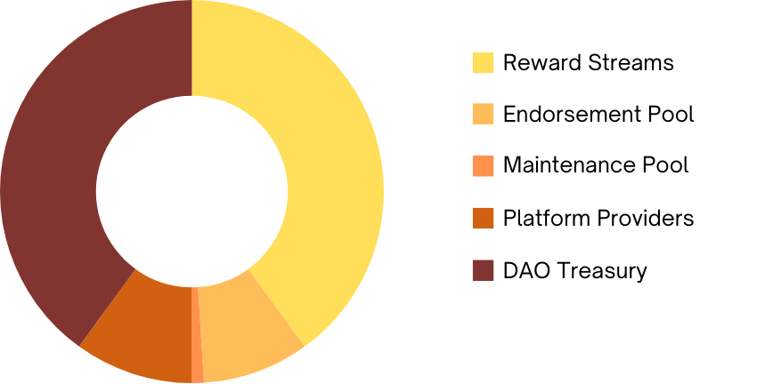

# Models: Disbursement

The Radix Name Service DAO has a well-structured revenue disbursement system designed to incentivize participation, support decentralized governance, and ensure continuous development. This revenue distribution model ensures that every aspect of the protocol—operations, community engagement, platform innovation, and development is well-supported. This balanced structure aligns the interests of all participants and fosters a collaborative ecosystem that encourages innovation and growth across the protocol.

---

## Allocation and Purpose
  

  

Here's a breakdown of the disbursement routes:

#### (40%) Reward Streams
A large portion of the DAO's revenue (40%) is allocated to Reward Streams, which incentivize participants to engage in core protocol activities. These streams reward actions like liquidity provision and proposal endorsement, ensuring the protocol remains robust and decentralized.

**Surety Stream (20%):** Provides rewards to users who collateralize proposals, supporting governance and protocol improvements. 
**Liquidity Stream (20%):** Rewards participants who contribute liquidity, ensuring that the protocol's markets function smoothly.

This 40% allocation ensures that active contributors are incentivized to participate in vital DAO activities, keeping the ecosystem liquid and operational.

#### (9%) Proposal Endorsement Pool
The Proposal Endorsement Pool receives 9% of the DAO's revenue and is key to incentivizing $RNS holders to back new ideas and developments within the DAO. This pool rewards those who endorse proposals by collateralizing $RNS, helping promising initiatives gain the necessary support to proceed through the governance process.

**Endorsement Rewards:** $RNS holders who endorse proposals are rewarded from this pool once the proposal is moved to the active Proposal Improvement Proposal (PIP) stage, further promoting engagement in governance.
This allocation ensures that community members are incentivized to engage in governance, providing the necessary backing for new ideas and initiatives that drive the protocol forward.

#### (1%) Maintenance Pool
The Maintenance Pool, funded by 1% of the DAO's revenue, supports the day-to-day operational tasks of the protocol. This pool compensates users who engage in dQueue tasks, ensuring that routine maintenance such as recalling expired genus names and other key functions continue uninterrupted.

**Task Execution Rewards:** Participants are rewarded for completing dQueue tasks, covering transaction fees and providing additional incentives for maintaining the protocol.
This pool ensures that the essential functions of the protocol remain sustainable and that participants are incentivized to support the protocol's ongoing operations.

#### (10%) to Platform Provider Commission
10% of the DAO's revenue is allocated to the Platform Providers, decentralized entities that function similarly to domain registrars but operate within The Radix Name Service ecosystem. These Platform Providers are part of the Platform Consortium and serve as the shopfronts for the sale of Apex Handles and Genus Domains.

**Decentralized Innovation:** Platform Providers offer unique frontends through which users can interact with the protocol. Having multiple providers creates an environment of "collaborative competition," where innovation is driven by each provider's community and customer base. 
**Shared Value:** Although each Platform Provider operates independently, the success of one provider benefits the entire ecosystem, as increased adoption of The Radix Name Service raises the visibility and value of Apex Handles and Genus Domains across all platforms.
This commission ensures that Platform Providers are compensated for their role in expanding the protocol's reach and adoption, fostering both innovation and community collaboration.

#### (40%) to the DAO Treasury
The remaining 40% of the revenue is allocated to the DAO Treasury, which acts as a reserve to fund future development and growth initiatives. This allocation ensures that the DAO has the resources to fuel its long-term success and adaptability.

**Development Funding:** Treasury funds are used to support new projects, features, and upgrades that benefit the protocol and the community. 
**Proposal-Based Disbursement:** Funds are released through successful proposals submitted by Platform Providers and other participants, ensuring that development is aligned with the DAO's collective vision and goals.
This allocation ensures that the DAO is self-sustaining and can continuously evolve through community-driven development.

<!-- changelog:start -->

This is the contribution that serves to keep track of ideation sources, authorship and documentation modifications within the DAO. If you have created or contributed to an idea, or optimized the content of this page, please fill out the form to allow others to see under which context the submission occurred.

| Name  | Date            | Notes |
| :-----: | :---------------: | :---------------------------: |
| James Wylie (Wylie.xrd) | 6th Oct 2024 | Concept Ideation / Authorship |

<!-- changelog:end -->