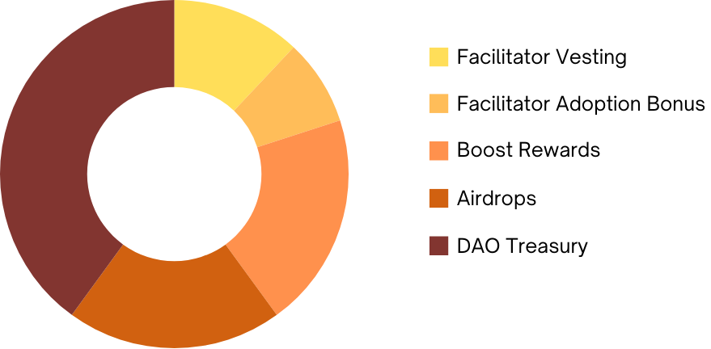

# Token Types: $RNS

The $RNS token is the offical utility token for The Radix Name Service. It's a fixed supply token, with 10 million tokens in existence and a well-structured disbursement procedure that follows a steady rate of protocol adoption (via Eras).

---

**The official token resource domain / address:** 
*resource://RNS.rns 
{{resource-address-here}}*

### $RNS Properties

- **Fully diluted supply:** 10,000,000.
- **Disbursement Methods:** Initial Airdrop, Boost Rewards & Treasury Grants.
- **Functions:** Adoption, innovation and development incentive mechanism. Detached tokenomics from the base stack (Radix) to provide service autonomy, remove network interdependence, create flexibility for future network interoperability opportunities and lower strategic reliance and risk with respect to $XRD. Exclusive perks for $RNS usage within the RNS DAO and Protocol.
- **Voting Rights:** No (see $gRNS).

### Distribution

  

  

- **DAO Treasury (40%):** 40% of the overall supply will be retained by the DAO and disbursed in the form of proposal implementation funding and development. The treasury also holds the right to propose allocation of excess treasury funds to liquidity pools for the sole purpose of creating stable and seamless cross-network bridges and aiding interoperability.
- **Community Airdrop / Engagement Rewards (20%):** Shortly after the Community Genesis Proposal passes (if it passes), 10% of the overall supply will be airdropped to existing .XRD domain holders. A further 10% will be progressively airdropped until depletion via engagement rewards.
- **Boost Rewards (20%):** To bootstrap the DAO and provide additional participation incentives, 20% of the overall supply will be allocated as part of the Boost Initiative. All $RNS rewards resulting from stream, pool and dQueue activity will be boosted by 25% until allocation depletion.
- **Facilitator Allocation (12% - vested):** The founding team is allocated 12% of the overall supply which is linearly vested over 2 years to the to incentivise the management and facilitation of the adoption roadmap (3% each).
- **Facilitator Adoption Bonuses (8% - conditional):** Conditional bonus rewards are proportionally unlocked for each Facilitator at every Adoption Era. This further incentivises the facilitators to assist the DAO in reaching its various Adoption Eras.

### Utility

The $RNS token has a number of utilities and perks:

**1. Apex Discounts:** Payment in $RNS results in a **30% discount** (in dollar terms) on all Apex Handles. 
**2. Genus Registries:** Apex Handle owners can apply to create a 'Genus Registry' (fees paid in $RNS). When denominated in $RNS, all genus names sold or renewed also receive a **20% discount** in genus sale / renewal fees. 
**3. Drop Auctions:** Genus registries and respective users can utilise the Protocol's 'Drop Auction' feature (bids denominated in $RNS). 
**4. Reward Streams:** $RNS holders can provide proposal collateral, endorse improvement proposals and deposit LP tokens in return for a portion of the corresponding Reward Stream.

### Airdrop / Engagement Rewards

20% of the overall $RNS supply is allocated to community airdrops and engagement rewards:

**Community Airdrop (10%):** Once the Community Genesis Proposal receives a mandate, all current domain holders will receive a proportional amount of $RNS for each Apex Handle in their possession (.xrd domain holders can claim these Apex's free of charge). 
**Engagement Rewards (10%):** Three of the upcoming Adoption Eras unlock a tranch of $RNS that the DAO will disburse in the form of engagement rewards. The Facilitators propose that the DAO funds development of a small suite of social oriented tools to allow users to interface their socials with The Radix Name Service. Exposure of The Radix Name Service such as utilising Apex Names in their X, Discord and Telegram handles or sharing official RNS content will result in fortnightly $RNS airdrops to users' connected addresses. $RNS rewards from this mechanism will be disbursed until pool depletion.

You can read more about the specific unlock criteria in the dedicated Engagement Rewards section.

### Boost Rewards

The RNS DAO features many mechanisms under which participants are rewarded, such as collateralizing proposals in return for Stream Rewards. The Boost Initiative primarily aims to really kickstart The Radix Name Service and attract a healthy level of DAO engagement in the early stages of the DAO by supplementing each of the rewards with a **25% bonus**. $RNS rewards from this boost mechanism will be disbursed until pool depletion.

You can read more about the boost specifics in the dedicated Boost Initiative section.

<!-- changelog:start -->

This is the contribution that serves to keep track of ideation sources, authorship and documentation modifications within the DAO. If you have created or contributed to an idea, or optimized the content of this page, please fill out the form to allow others to see under which context the submission occurred.

| Name  | Date            | Notes |
| :-----: | :---------------: | :---------------------------: |
| James Wylie (Wylie.xrd) | 6th Oct 2024 | Concept Ideation / Authorship |

<!-- changelog:end -->